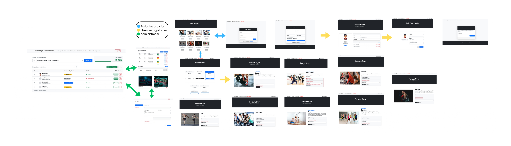
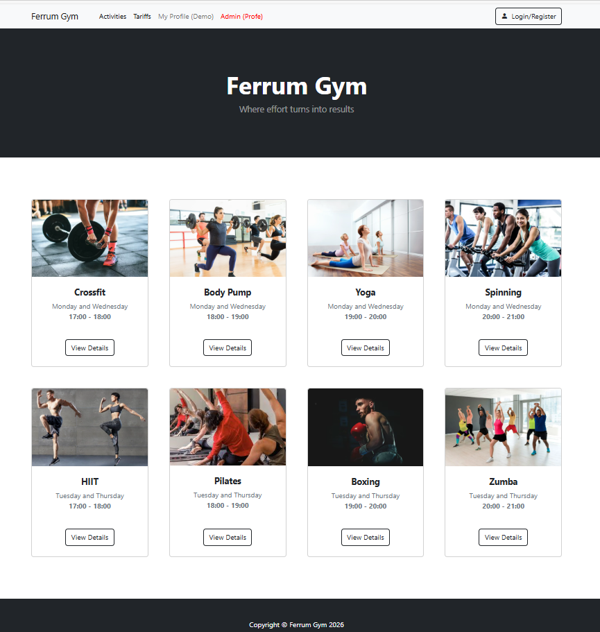
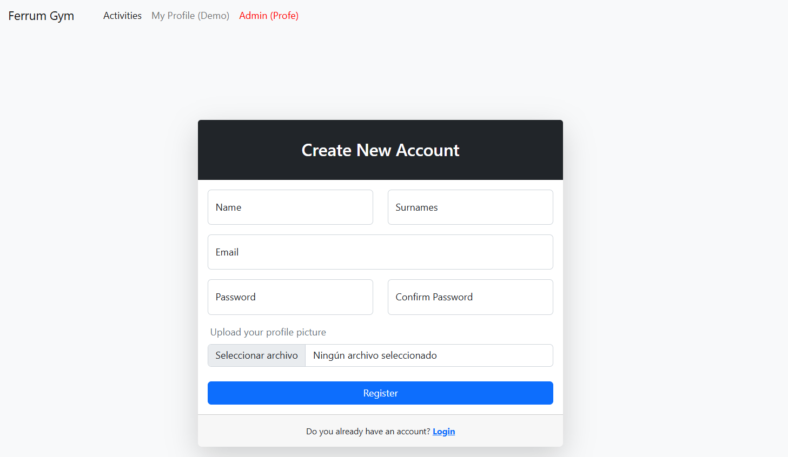
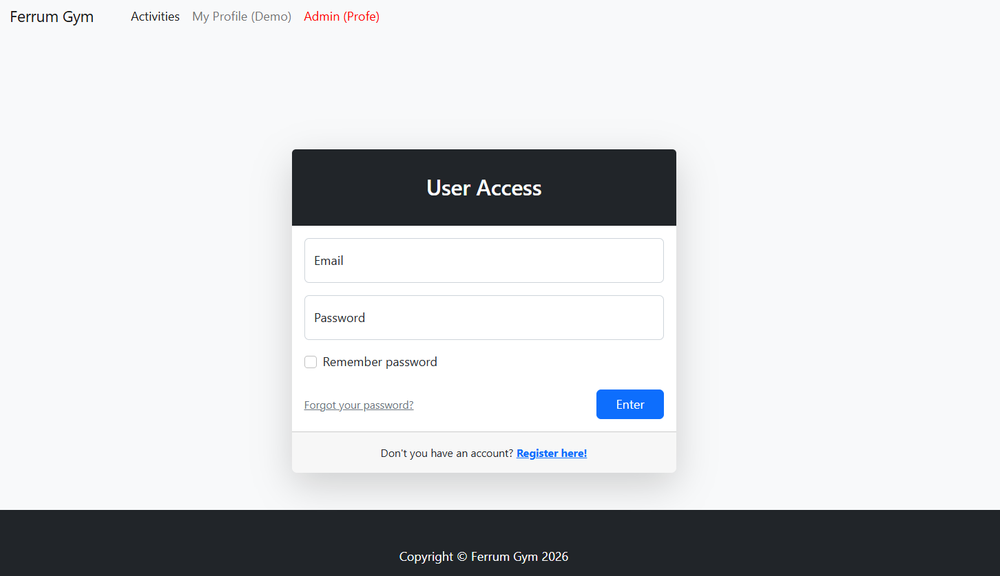
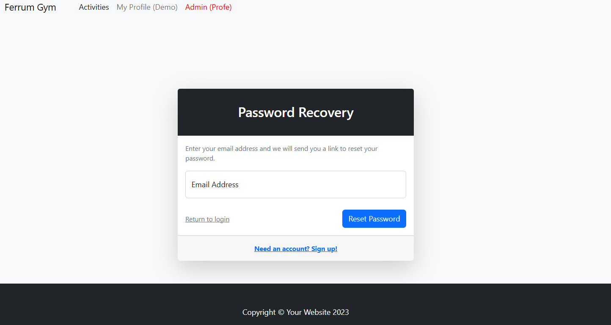
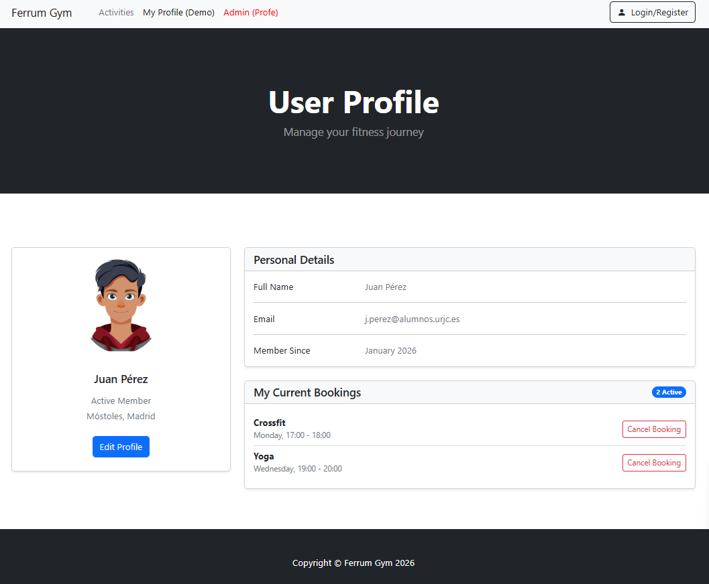
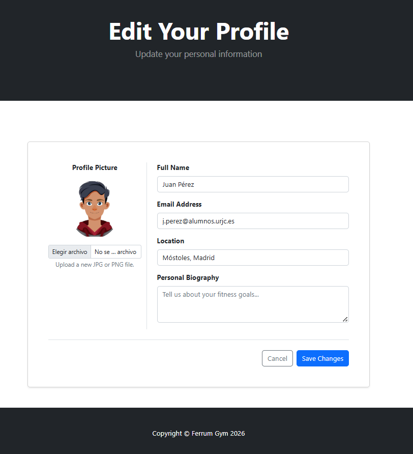
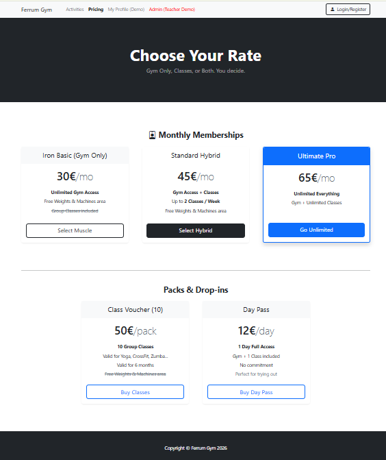
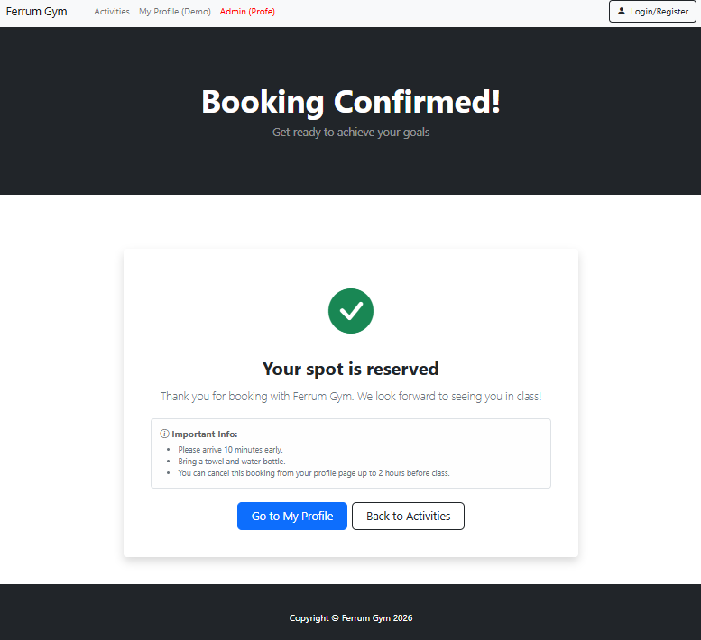
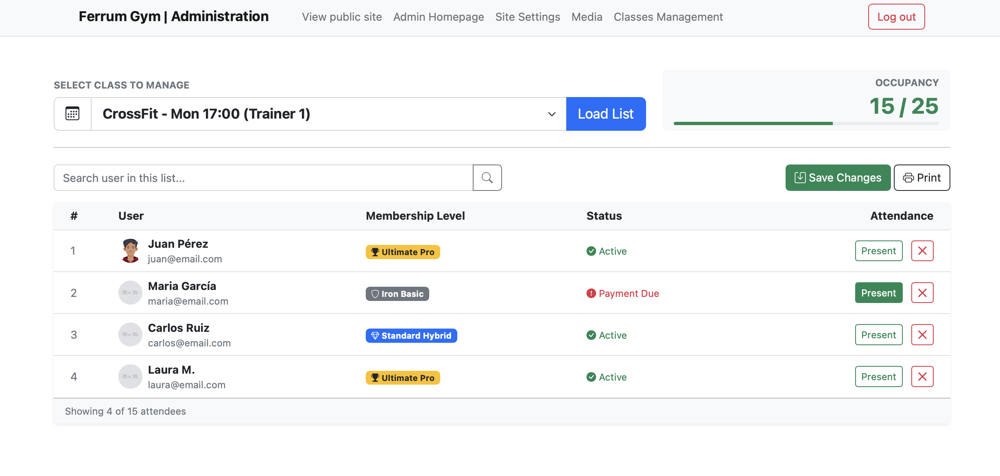

# Ferrum Gym

## 👥 Miembros del Equipo
| Nombre y Apellidos | Correo URJC | Usuario GitHub |
|:--- |:--- |:--- |
| Roberto Acebes Morán | r.acebes.2024@alumnos.urjc.es | robertoacebes |
| Luis Estirado Revuelta | l.estirado.2024@alumnos.urjc.es | koldoest26 |
| Elena González Rodríguez | e.gonzalezro.2024@alumnos.urjc.es | egonzalezro |
| Jaime Salgado Carballeda | j.salgado.2024@alumnos.urjc.es | Salga0 |

---

## 🎭 **Preparación: Definición del Proyecto**

### **Descripción del Tema**
Nuestra aplicación web es una plataforma de gestión para un gimnasio que permite a los usuarios consultar horarios, reservar clases colectivas y valorar su experiencia.
El sector es el de la salud y biniesetar, aportando valor al usuario al organizar su planificación deportiva y permitir al administrador controlar el aforo y las actividades de forma eficiente.

### **Entidades**
Indicar las entidades principales que gestionará la aplicación y las relaciones entre ellas:

1. **Usuario**: Entran los clientes, entrenadores y el administrador
2. **Actividad**: El conjunto de las clases ofertadas (crossfit, yoga, pilates, maquinas)
3. **Reserva**: La inscripcion de un cliente a una actividad
4. **Reseña**: Valoracion de un cliente sobre una actividad

**Relaciones entre entidades:**
- Usuario - Reserva: Un usuario puede tener varias resevas de actividades (1:N)
- Usuario - Reseña: Un usuario puede escribir varias reseñas (1:N)
- Actividad - Reserva: Una actividad puede ser reservada por multiples usuarios (1:N)
- Actividad - Reseña: Una actividad puede recibir muchas reseñas por parte de un usuario (1:N)

### **Permisos de los Usuarios**
Describir los permisos de cada tipo de usuario e indicar de qué entidades es dueño:

* **Usuario Anónimo**:
  - Permisos: Visualización del listado de actividades y horarios, lectura de reseñas públicas, acceso a la página de login y registro.
  - No es dueño de ninguna entidad.

* **Usuario Registrado**:
  - Permisos: Gestión de su perfil personal, posibilidad de realizar reservas en las actividades disponibles, cancelación de sus propias reservas y redacción de reseñas sobre las actividades realizadas.
  - Es dueño de: Entidad Usuario (su propio perfil); Entidad Reserva (consulta de las reservas que ha realizado); Entidad Reseña (Las valoraciones que ha escrito (solo él puede editarlas o borrarlas).

* **Administrador**:
  - Permisos: Gestión completa de la plataforma. Puede crear, editar y eliminar actividades (CRUD completo). Tiene capacidad para moderar reseñas inadecuadas y visualizar el listado completo de reservas y usuarios.
  - Es dueño de: Entidad Actividad (encargado de dar de alta y gestionar las clases); Así mismo, tiene permisos sobre todos los objetos para tareas de mantenimiento del sitio.

### **Imágenes**
Indicar qué entidades tendrán asociadas una o varias imágenes:

- **Entidad Usuario**: Cada usuario podrá subir una imagen de perfil (avatar) para personalizar su cuenta.
- **Entidad Actividad**: Cada actividad ofertada tendrá asociada una imagen representativa.
- **Entidad Reseña**: Los usuarios podrán adjuntar una fotografía a su reseña.

- ### **Funcionalidad**
Almacenamiento de ficheros:
- **PDF**: En cada actividad estará alojado un PDF con la información de la actividad. Este fichero podrá ser subido por el administrador y descargado por cualquier usuario (registrado o anónimo).

---

## 🛠 **Práctica 1: Maquetación de páginas con HTML y CSS**

### **Vídeo de Demostración**
📹 **[Enlace al vídeo en YouTube](https://youtu.be/PnQ4OdEDfU4)**
> Vídeo mostrando las principales funcionalidades de la aplicación web.

### **Diagrama de Navegación**
Diagrama que muestra cómo se navega entre las diferentes páginas de la aplicación:



> Descripción del flujo de navegación: El flujo de navegación parte de una barra de menú superior común que permite acceder a las secciones públicas de la web. Los usuarios anónimos pueden visualizar el catálogo de actividades y acceder a los formularios de registro e inicio de sesión. Una vez autenticados, los usuarios registrados obtienen acceso a su área personal para gestionar reservas y editar su perfil, mientras que el administrador es redirigido a un panel de gestión privado (Dashboard) desde donde puede administrar clases, usuarios, reseñas y la configuración del sitio.

### **Capturas de Pantalla y Descripción de Páginas**

#### **1. Página Principal / Home**


> Página principal que muestra las actividades ofertadas con los horarios disponibles. Incluye acceso a registro/login para usuarios no autenticados y una opcion para ver el perfil de los usuarios registrados.

#### **2. Página de Creación de Cuenta (Register)**


> Página de registro para nuevos usuarios del gimnasio. Muestra un formulario para introducir el nombre, apellidos, correo electrónico, contraseña y confirmación de la misma. También permite subir una foto de perfil. Cuenta con un botón azul de "Register" y un enlace para iniciar sesión si ya se tiene una cuenta.

#### **3. Página de Acceso de Usuario (Login)**


> Página de inicio de sesión para usuarios del gimnasio. Muestra un formulario con campos para introducir el correo electrónico y la contraseña, una opción para recordar la contraseña y un enlace para recuperarla si se ha olvidado. Incluye un botón azul de "Enter" y un enlace para registrarse si no se dispone de cuenta.

#### **4. Página de Recuperación de Contraseña**


> Página diseñada para restablecer el acceso a la cuenta. Muestra un campo para ingresar la dirección de correo electrónico y recibir un enlace de recuperación. Incluye un botón azul de "Reset Password", un enlace para volver al inicio de sesión (Return to login) y una opción inferior para registrarse (Sign up!) si el usuario aún no posee una cuenta.

#### **5. Página de Usuario Registrado (User-profile)**


> Página que muestra el perfil del usuario registrado (area privada del usuario), donde se pueden ver sus datos personales como nombre, apellidos y correo, posibilidad de cargar un avatar y su historial de reservas actual. Cuenta con un boton azul que permite cambiar los datos personales del ususario registrado.

#### **6. Página de Edicion de Usuario (Edit-profile)**


> Página que permite al usuario registrado cambiar sus datos, desde el nombre, correo y ubicación hasta cargar una nueva imagen de perfil o poner una biografía. Cuenta con un boton de guardar cambios y otro para cancelar la operación.

#### **7. Página de tarifas**


> Página estructurada en dos secciones claras: Planes Mensuales y Packs Flexibles.Presenta tres niveles de suscripción (Iron Basic, Standard Hybrid y Ultimate Pro destacada en azul) junto con opciones de pago único como bonos de clases o pases diarios, detallando el precio y el tipo de acceso de cada tarifa.

#### **8. Página con mas detalles sobre la Actividad**


> Página que muestra mas información sobre la actividad seleccionada como una breve descripción de la actividad y una zona donde puedes descargar un fichero si quieres obtener mas información como el horario. También hay una opción para reservar plaza, seleccionando el día que se quiera. En el caso de que la actividad seleccionada este completa de aforo se marcará en rojo y no dejará realizar la reserva.

#### **9. Página de Confirmación de Reserva Exitosa**


> Página que muestra un mensaje de validación con un icono de verificación verde indicando que la plaza ha sido asegurada. Incluye un cuadro informativo con recordatorios útiles sobre la asistencia y la política de cancelación (hasta 2 horas antes). Cuenta con un botón azul de "Go to My Profile" para gestionar las reservas y otro botón secundario para regresar al listado de actividades.

#### **10. Página de principal del Administrador**


> Página principal de gestión del Gimnasio. Muestra tablas resumen para la gestión de Clases (con indicadores visuales de aforo), Usuarios (con estados y roles) y moderación de Reseñas. Incluye botones de acción rápida para editar, borrar o bloquear elementos. Así mismo, dispone de un menú para moverse por las distintas páginas del panel de administración.

#### **11. Página de Configuración del Gimnasio**


> Panel de configuración global que permite modificar la información del negocio (horarios, contacto) y activar el "Modo Mantenimiento" mediante interruptores (toggles).

#### **12. Página de Gestión de Clases**


> Herramienta avanzada para entrenadores y administradores. Permite seleccionar una sesión específica mediante un desplegable y visualizar el listado de alumnos inscritos. Muestra el estado de pago de cada socio y permite pasar lista mediante checkboxes interactivos.


### **Participación de Miembros en la Práctica 1**

#### **Alumno 1 - Roberto Acebes Moran**

Creación y desarrolllo de las páginas de perfil de usuarios registrados y edición del mismo. También, cargar las imágenes de las actividades asi como establecer el horario y días de impartición. Además, he supervisado (realizando modificaciones) el formato de los ficheros (contenido y forma) .html de todo el proyecto.

| Nº    | Commits      | Files      |
|:------------: |:------------:| :------------:|
|1| [Create User Profile](https://github.com/DWS-2026/project-grupo-16/commit/890e631407d9daf9cdca7009320f40037eee88e9)  | [user-profile.html](https://github.com/DWS-2026/project-grupo-16/blob/main/user-profile.html)   |
|2| [Create User Edit Profile](https://github.com/DWS-2026/project-grupo-16/commit/e384845db61812b4d7e09eee04754bc2fe06a7a6)  | [edit-profile.html](https://github.com/DWS-2026/project-grupo-16/blob/main/edit-profile.html)   |
|3| [Creation of Activities](https://github.com/DWS-2026/project-grupo-16/commit/df2d9b002bb13e0ceb2ed57123a545426d0b7a1c)  | [index.html](https://github.com/DWS-2026/project-grupo-16/blob/main/index.html)   |
|4| [Change format of all the files](https://github.com/DWS-2026/project-grupo-16/commit/3dffe60179be7045fa26312b1b5dc8830bebb216)  |All activity files |

---

#### **Alumno 2 - Elena González Rodríguez**

Creación y desarrollo de las páginas de inicio de sesión y registro (incluyendo la página de olvido de contraseña de la cuenta del usuario), la página de confirmación de reserva exitosa y la página de las diferentes tarifas del gimnasio.

| Nº    | Commits      | Files      |
|:------------: |:------------:| :------------:|
|1| [Create Login](https://github.com/DWS-2026/project-grupo-16/commit/22145abc9606f203abd05fa641fc6e8b08870a61)  | [login.html](https://github.com/DWS-2026/project-grupo-16/blob/main/login.html)   |
|2| [Create Register](https://github.com/DWS-2026/project-grupo-16/commit/22145abc9606f203abd05fa641fc6e8b08870a61)  | [register.html](https://github.com/DWS-2026/project-grupo-16/blob/main/register.html)   |
|3| [Add forgot password page navigation](https://github.com/DWS-2026/project-grupo-16/commit/ec980fc8b8928fe9fef43a2768dd579e7afbbca5)  | [forgot-password.html](https://github.com/DWS-2026/project-grupo-16/blob/main/forgot-password.html)   |
|4| [Adding the completed booking page](https://github.com/DWS-2026/project-grupo-16/commit/cef3516fd2bdcff585e881c34d06d8b68f905ccc)  | [booking-success.html](https://github.com/DWS-2026/project-grupo-16/blob/main/booking-success.html)   |
|5| [Create Prices](https://github.com/DWS-2026/project-grupo-16/commit/35f3412d2cf25c716a16759c870a96dec0d6536c)  | [prices.html](https://github.com/DWS-2026/project-grupo-16/blob/main/prices.html)   |

---

#### **Alumno 3 - [Luis Estirado Revuelta]**

Creación y desarrollo de las páginas del panel de administración, tales como la página principal, la página de gestión de las clases como también la página de gestión del sitio web. Así mismo, la creación del fichero admin.css para los estilos CSS del panel y así separar los estilos de la parte pública.

| Nº    | Commits      | Files      |
|:------------: |:------------:| :------------:|
|1| [Create dashboard](https://github.com/DWS-2026/project-grupo-16/commit/31166d51900f57da8c3d0dda32101382682a5dd8)  | [admin-dashboard.html](https://github.com/DWS-2026/project-grupo-16/blob/main/admin-dashboard.html)   |
|2| [Create site settings](https://github.com/DWS-2026/project-grupo-16/commit/5410f4b1b68239bd0f5d80e949a602029e589d4a)  | [site-settings.html](https://github.com/DWS-2026/project-grupo-16/blob/main/site-settings.html)   |
|3| [Create classes management](https://github.com/DWS-2026/project-grupo-16/commit/d21593a7c8bc36c62f450d21e9aebc2fa952e7c6)  | [admin-class.html](https://github.com/DWS-2026/project-grupo-16/blob/main/admin-class.html)   |
|4| [Create admin.css](https://github.com/DWS-2026/project-grupo-16/commit/1502495ea90c1cc170404201821b8fde00218e62)  | [admin.css](https://github.com/DWS-2026/project-grupo-16/blob/main/css/admin.css)   |

---

#### **Alumno 4 - [Jaime Salgado Carballeda]**

[Descripción de las tareas y responsabilidades principales del alumno en el proyecto]

| Nº    | Commits      | Files      |
|:------------: |:------------:| :------------:|
|1| [Descripción commit 1](URL_commit_1)  | [Archivo1](URL_archivo_1)   |
|2| [Descripción commit 2](URL_commit_2)  | [Archivo2](URL_archivo_2)   |
|3| [Descripción commit 3](URL_commit_3)  | [Archivo3](URL_archivo_3)   |
|4| [Descripción commit 4](URL_commit_4)  | [Archivo4](URL_archivo_4)   |
|5| [Descripción commit 5](URL_commit_5)  | [Archivo5](URL_archivo_5)   |

---

## 🛠 **Práctica 2: Web con HTML generado en servidor**

### **Vídeo de Demostración**
📹 **[Enlace al vídeo en YouTube](https://www.youtube.com/watch?v=x91MPoITQ3I)**
> Vídeo mostrando las principales funcionalidades de la aplicación web.

### **Navegación y Capturas de Pantalla**

#### **Diagrama de Navegación**

Solo si ha cambiado.

#### **Capturas de Pantalla Actualizadas**

Solo si han cambiado.

### **Instrucciones de Ejecución**

#### **Requisitos Previos**
- **Java**: versión 21 o superior
- **Maven**: versión 3.8 o superior
- **MySQL**: versión 8.0 o superior
- **Git**: para clonar el repositorio

#### **Pasos para ejecutar la aplicación**

1. **Clonar el repositorio**
   ```bash
   git clone https://github.com/[usuario]/[nombre-repositorio].git
   cd [nombre-repositorio]
   ```

2. **AQUÍ INDICAR LO SIGUIENTES PASOS**

#### **Credenciales de prueba**
- **Usuario Admin**: usuario: `admin`, contraseña: `admin`
- **Usuario Registrado**: usuario: `user`, contraseña: `user`

### **Diagrama de Entidades de Base de Datos**

Diagrama mostrando las entidades, sus campos y relaciones:


> [Descripción opcional: Ej: "El diagrama muestra las 4 entidades principales: Usuario, Producto, Pedido y Categoría, con sus respectivos atributos y relaciones 1:N y N:M."]

### **Diagrama de Clases y Templates**

Diagrama de clases de la aplicación con diferenciación por colores o secciones:


> [Descripción opcional del diagrama y relaciones principales]

### **Participación de Miembros en la Práctica 2**

#### **Alumno 1 - [Nombre Completo]**

[Descripción de las tareas y responsabilidades principales del alumno en el proyecto]

| Nº    | Commits      | Files      |
|:------------: |:------------:| :------------:|
|1| [Descripción commit 1](URL_commit_1)  | [Archivo1](URL_archivo_1)   |
|2| [Descripción commit 2](URL_commit_2)  | [Archivo2](URL_archivo_2)   |
|3| [Descripción commit 3](URL_commit_3)  | [Archivo3](URL_archivo_3)   |
|4| [Descripción commit 4](URL_commit_4)  | [Archivo4](URL_archivo_4)   |
|5| [Descripción commit 5](URL_commit_5)  | [Archivo5](URL_archivo_5)   |

---

#### **Alumno 2 - [Nombre Completo]**

[Descripción de las tareas y responsabilidades principales del alumno en el proyecto]

| Nº    | Commits      | Files      |
|:------------: |:------------:| :------------:|
|1| [Descripción commit 1](URL_commit_1)  | [Archivo1](URL_archivo_1)   |
|2| [Descripción commit 2](URL_commit_2)  | [Archivo2](URL_archivo_2)   |
|3| [Descripción commit 3](URL_commit_3)  | [Archivo3](URL_archivo_3)   |
|4| [Descripción commit 4](URL_commit_4)  | [Archivo4](URL_archivo_4)   |
|5| [Descripción commit 5](URL_commit_5)  | [Archivo5](URL_archivo_5)   |

---

#### **Alumno 3 - [Nombre Completo]**

[Descripción de las tareas y responsabilidades principales del alumno en el proyecto]

| Nº    | Commits      | Files      |
|:------------: |:------------:| :------------:|
|1| [Descripción commit 1](URL_commit_1)  | [Archivo1](URL_archivo_1)   |
|2| [Descripción commit 2](URL_commit_2)  | [Archivo2](URL_archivo_2)   |
|3| [Descripción commit 3](URL_commit_3)  | [Archivo3](URL_archivo_3)   |
|4| [Descripción commit 4](URL_commit_4)  | [Archivo4](URL_archivo_4)   |
|5| [Descripción commit 5](URL_commit_5)  | [Archivo5](URL_archivo_5)   |

---

#### **Alumno 4 - [Nombre Completo]**

[Descripción de las tareas y responsabilidades principales del alumno en el proyecto]

| Nº    | Commits      | Files      |
|:------------: |:------------:| :------------:|
|1| [Descripción commit 1](URL_commit_1)  | [Archivo1](URL_archivo_1)   |
|2| [Descripción commit 2](URL_commit_2)  | [Archivo2](URL_archivo_2)   |
|3| [Descripción commit 3](URL_commit_3)  | [Archivo3](URL_archivo_3)   |
|4| [Descripción commit 4](URL_commit_4)  | [Archivo4](URL_archivo_4)   |
|5| [Descripción commit 5](URL_commit_5)  | [Archivo5](URL_archivo_5)   |

---

## 🛠 **Práctica 3: Incorporación de una API REST a la aplicación web, análisis de vulnerabilidades y contramedidas**

### **Vídeo de Demostración**
📹 **[Enlace al vídeo en YouTube](https://www.youtube.com/watch?v=x91MPoITQ3I)**
> Vídeo mostrando las principales funcionalidades de la aplicación web.

### **Documentación de la API REST**

#### **Especificación OpenAPI**
📄 **[Especificación OpenAPI (YAML)](/api-docs/api-docs.yaml)**

#### **Documentación HTML**
📖 **[Documentación API REST (HTML)](https://raw.githack.com/[usuario]/[repositorio]/main/api-docs/api-docs.html)**

> La documentación de la API REST se encuentra en la carpeta `/api-docs` del repositorio. Se ha generado automáticamente con SpringDoc a partir de las anotaciones en el código Java.

### **Diagrama de Clases y Templates Actualizado**

Diagrama actualizado incluyendo los @RestController y su relación con los @Service compartidos:


#### **Credenciales de Usuarios de Ejemplo**

| Rol | Usuario | Contraseña |
|:---|:---|:---|
| Administrador | admin | admin123 |
| Usuario Registrado | user1 | user123 |
| Usuario Registrado | user2 | user123 |

### **Participación de Miembros en la Práctica 3**

#### **Alumno 1 - [Nombre Completo]**

[Descripción de las tareas y responsabilidades principales del alumno en el proyecto]

| Nº    | Commits      | Files      |
|:------------: |:------------:| :------------:|
|1| [Descripción commit 1](URL_commit_1)  | [Archivo1](URL_archivo_1)   |
|2| [Descripción commit 2](URL_commit_2)  | [Archivo2](URL_archivo_2)   |
|3| [Descripción commit 3](URL_commit_3)  | [Archivo3](URL_archivo_3)   |
|4| [Descripción commit 4](URL_commit_4)  | [Archivo4](URL_archivo_4)   |
|5| [Descripción commit 5](URL_commit_5)  | [Archivo5](URL_archivo_5)   |

---

#### **Alumno 2 - [Nombre Completo]**

[Descripción de las tareas y responsabilidades principales del alumno en el proyecto]

| Nº    | Commits      | Files      |
|:------------: |:------------:| :------------:|
|1| [Descripción commit 1](URL_commit_1)  | [Archivo1](URL_archivo_1)   |
|2| [Descripción commit 2](URL_commit_2)  | [Archivo2](URL_archivo_2)   |
|3| [Descripción commit 3](URL_commit_3)  | [Archivo3](URL_archivo_3)   |
|4| [Descripción commit 4](URL_commit_4)  | [Archivo4](URL_archivo_4)   |
|5| [Descripción commit 5](URL_commit_5)  | [Archivo5](URL_archivo_5)   |

---

#### **Alumno 3 - [Nombre Completo]**

[Descripción de las tareas y responsabilidades principales del alumno en el proyecto]

| Nº    | Commits      | Files      |
|:------------: |:------------:| :------------:|
|1| [Descripción commit 1](URL_commit_1)  | [Archivo1](URL_archivo_1)   |
|2| [Descripción commit 2](URL_commit_2)  | [Archivo2](URL_archivo_2)   |
|3| [Descripción commit 3](URL_commit_3)  | [Archivo3](URL_archivo_3)   |
|4| [Descripción commit 4](URL_commit_4)  | [Archivo4](URL_archivo_4)   |
|5| [Descripción commit 5](URL_commit_5)  | [Archivo5](URL_archivo_5)   |

---

#### **Alumno 4 - [Nombre Completo]**

[Descripción de las tareas y responsabilidades principales del alumno en el proyecto]

| Nº    | Commits      | Files      |
|:------------: |:------------:| :------------:|
|1| [Descripción commit 1](URL_commit_1)  | [Archivo1](URL_archivo_1)   |
|2| [Descripción commit 2](URL_commit_2)  | [Archivo2](URL_archivo_2)   |
|3| [Descripción commit 3](URL_commit_3)  | [Archivo3](URL_archivo_3)   |
|4| [Descripción commit 4](URL_commit_4)  | [Archivo4](URL_archivo_4)   |
|5| [Descripción commit 5](URL_commit_5)  | [Archivo5](URL_archivo_5)   |
